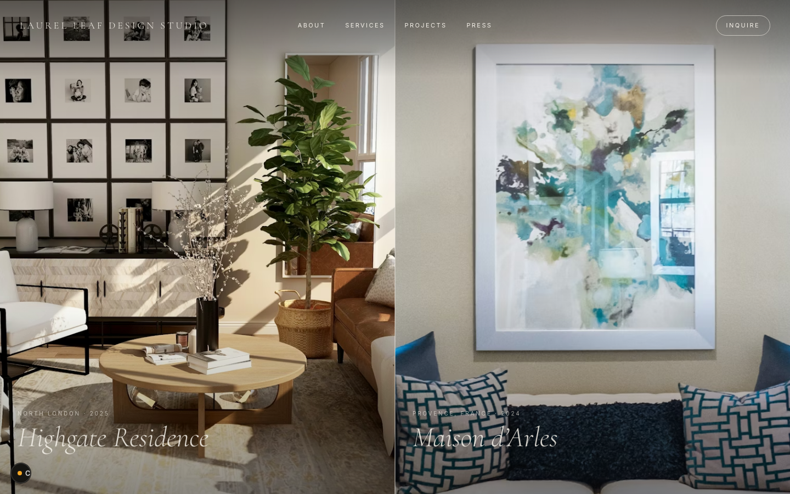

# Laurel Leaf Design Studio

The marketing site for Laurel Leaf Design Studio — an interior design practice based in the Augusta/Aiken region, founded in 2020 by Maria Rhinehart. The studio works on residential and small commercial projects with an unhurried, architecture-first approach.



## What's in here

A small, editorial Next.js site organised around the studio's work:

- **Home** — a full-bleed project hero grid with scroll-driven parallax, a studio statement, and a horizontal project strip
- **Projects** — index and detail pages for each commission (`app/projects/`)
- **Services** — disciplines and engagement model, with a sticky in-page nav
- **About** — studio story, founder bio, and location
- **Press** — published work and recognition
- **Inquire** — a typed contact form (React Hook Form + Zod)

The look is poster-scale serif display type (Cormorant Garamond), Inter for UI text, a low palette of bone/ink, and motion that's slow on purpose.

## Stack

- **Next.js 16.2** App Router with **Turbopack** (dev and build)
- **React 19.2** + TypeScript
- **Tailwind v4** for a handful of layout utilities only — the rest is a token-driven design system in `lib/tokens.ts` and primitives in `components/ui/`
- **React Hook Form** + **Zod** for the inquiry form
- **ESLint** (flat config) + **Prettier** + **Husky** / **lint-staged** pre-commit hook
- Deployed on **Vercel**

Project conventions, design tokens, CSS pitfalls, and Next 16-specific gotchas are documented in [`AGENTS.md`](./AGENTS.md).

## Getting started

```bash
npm install
npm run dev          # http://localhost:3000
```

### Useful scripts

```bash
npm run build        # Production build (Turbopack)
npm run lint         # ESLint --max-warnings=0 + CSS guard
npm run typecheck    # tsc --noEmit
npm run format       # Prettier write
```

## Layout

```
app/                 # App Router routes, layouts, pages
components/          # Feature components (Header, HeroGrid, ProjectDetail, …)
components/ui/       # Design system primitives (Section, Grid, Heading, Eyebrow, Container)
hooks/               # One hook per file, imported as @/hooks/<name>
lib/tokens.ts        # Single source of truth: color, spacing, type, motion
lib/projects.ts      # Project data
public/images/       # Local image assets (Unsplash URLs are placeholders)
```

The screenshot above lives in `docs/screenshot.png` — regenerate it with headless Chrome against a running dev server if the home page changes meaningfully.
